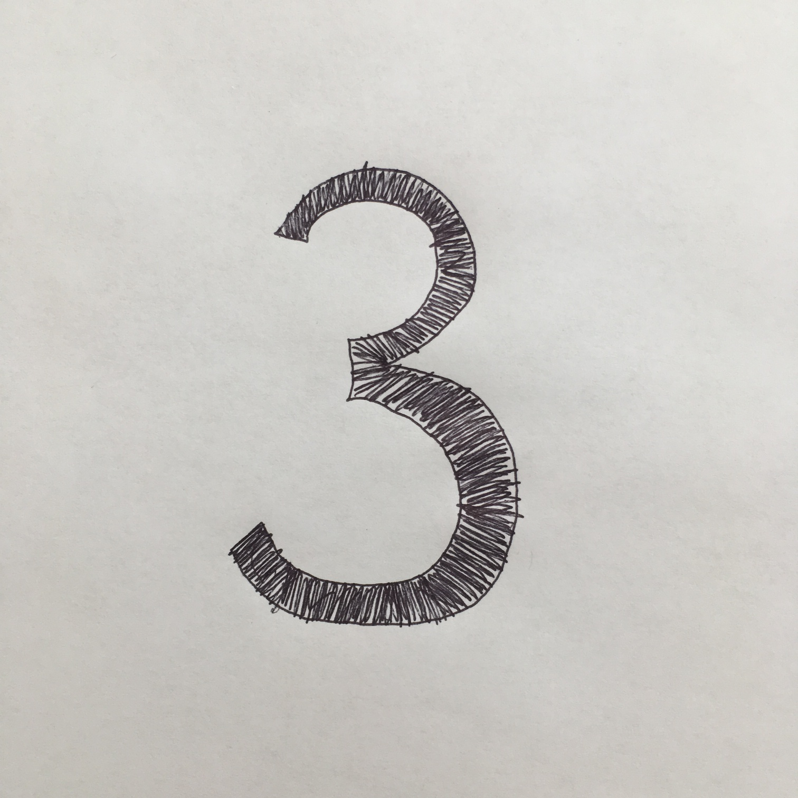

# Title: Machine Vision!
## TL;DR: Build a series of convolutional neural networks that classify numbers, letters, and objects.
## What is Machine Learning?
Machine learning (a type of artificial intelligence or AI) is a set of algorithms that learn to do tasks without being explicitly programmed. In this problem set, you will create the building blocks for your own convolutional neural network, a type of machine learning model that’s based on the biology of human vision and handy for enabling computers to “recognize” images (machine vision). You can then apply your model (with some tweaking) in new ways you dream up. 

Okay, but what are some examples of how machine learning plays a role in our lives?

Well, have you ever played with the Google photos app? Or the Google translate AR app?

Watched a self-driving car navigate a road? 

Or consider this: you’re on a mission to help folks in a remote area. You use your phone’s camera to examine someone’s eye and a machine vision app accurately spots the presence of a disease like diabetic retinopathy. 

Machine learning as a whole is a rapidly expanding field with profound impacts and lots of opportunities to stake out creative new uses. It is transforming industries ranging from healthcare to education to transportation to finance. 

This problem set will enable you to code your own algorithms for handwriting recognition and object classification. You can then apply the concepts you learn and the model you master to many other challenges. 

Machine learning projects generally follow these core steps, which you’ll be implementing in this problem set:

1. Get data and clean it up so your model can efficiently find useful patterns in the data.
2. Engineer your model’s architecture.
3. Train your model on your data and evaluate its performance.
4. Iterate to improve the performance of your model.
5. Apply your model to your own data!

## Setting Up 
### NOTE: Please follow these instructions for now: https://bit.ly/2Km6RPs

To start, open a terminal window and execute “update50” to make sure your workspace is up-to-date.

Next, navigate to your ~/workspace/chapter[IDK] directory. To download the distro code, execute either:

wget https://raw.githubusercontent.com/ChloeL19/CNN-pset/master/Student_Code/c9_less_comfy/less_comfy.zip

If you’re feeling a bit less comfy.

Or:

wget https://raw.githubusercontent.com/ChloeL19/CNN-pset/master/Student_Code/c9_more_comfy/student_more_comfy.zip

If you’re feeling more comfy.

Then unzip that ZIP file, delete it, and navigate into your newly-created directory. If you list the contents of your directory, you should find seven files therein. The files in bold are the ones you will edit:

* #### MNIST_preprocessing.py
* EMNIST_preprocessing.py
* #### CIFAR_preprocessing.py
* #### model_architecture.py
* #### main.py
* #### custom_prediction.py
* visualization.py

## First Challenge: Preprocess the MNIST data
As a data scientist, a vital part of the job is to feed your model clean and useful data. Your first challenge: prep your data properly. 

The MNIST dataset contains 70,000 images of handwritten numbers. We want our network to take the pixel values of each image as input, and then output the probability that the number represented by the pixel data is a 1, 2, 3, etc. In order to help our model can train efficiently with this data, we need to ensure the arrays of pixel values representing each image are of the appropriate shape and magnitude. 

Take a look in the “MNIST_preprocessing_students.py” file, where we’ve called the mnist.load_data() function to create four arrays of values:

* X_train: This is an array of 60,000 training examples, which represents about 85% of the total dataset (usually 80-90% of the dataset is devoted to training the model). Why 60,000? Well, typically we want enough data so that the model can learn to pick up helpful patterns, but not so much that the training process become unwieldy. Each training example contains pixel values ranging from 0-255 for a black-and-white image of a handwritten number.
* Y_train: This is an array of labels for each of the 60,000 images in the X training dataset. Each label is an integer from 0-9 that corresponds to the number pictured. 
* X_test: This is an array of 10,000 testing examples with the same format as in X_train. This set of data is used to see how well the model performs at classifying images of numbers it has never seen before.
* Y_test: This is an array of 10,000 labels for the X_test dataset. (It has the same format as the Y_train array.)

Here’s the breakdown of what you need to do in this file:

* Ensure the X_train and X_test arrays have the right formats so that the convolutional neural network can easily read the input images as a giant array of pixel values. Currently, the X_train data is represented as an array of shape (60000, 28, 28), and the shape of the X_test array is (10000, 28, 28). This makes sense, because X_train is storing the pixel values of 60,000 images with a height and width of 28 pixels (and X_test is similarly storing the values for 10,000 images). The convolutional neural network, however, needs each image in the dataset to have three dimensions: height, width, and color channels. Since MNIST images are strictly black and white, you need to insert another dimension so that each image is stored as an array with these dimensions: (28, 28, 1). (As an aside, this scheme means that color images would be stored as arrays of shape: (28, 28, 3), since they have three color channels for red, green, and blue.)
* “Normalize” the pixel values. This means you need to find a way to put these values in the range of 0 to 1 (they currently range from 0 to 255). By “smooshing” all of the training data into this scale, the neural network will learn more efficiently. 
* If the verbose argument is set to “True”, print an example training image to the screen along with its label so we know exactly what type of data we’re dealing with here. 
* Finally, you need to convert each entry in the Y_train and Y_test arrays into a one-hot vector. A one-hot vector is a vector in which all of the elements are zero except for a single “1”. Why? We use a one-hot vector to enable our model to compare its output to the expected output. How? The row of numbers in the one-hot vector represent how likely the input image belongs in the given class: 0 if it doesn’t fit and 1 if it is a 100% fit. If, for example, we give the network an image of a “3”, we want the network to say the image has a close to 100% probability of being a 3. That means the vector would display 1  in the spot that represents the number “3”:
  
(Note: arrays are indexed from “0” hence the index representing “3” is in the fourth position)

Chances are, you’ll probably want to use some functions from Keras.utils, and maybe some from matplotlib. 

## Second Challenge: Build the model’s architecture
You’re ready to build your first convolutional model in the model_architecture.py file! 

To better understand how convolutional models work, you may appreciate this quick video by one of the top scientists at the Google Brain Team:

 

To build your convolutional neural network, you will need to construct a stack of layers. A layer is a function that takes an input volume of data and converts it into a different output volume of data (remember the boxes from the video?). 

You will be choosing and combining the following layers in different ways to build your model. You can use any combination of layers although some combinations will work better together than others. Later on, you'll get a chance to test how your model performs!

Here are the layer options:

* Input: This constructs an input layer for your neural network. It takes the shape of the input data as an argument. 
* Conv2d: This is your classic convolutional layer for images. It contains filters (kernels) with learnable parameters that slide (convolve) over an input data matrix, computing the dot product with each chunk of the input matrix they go. Over time, these filters will learn to activate when they recognize certain visual patterns, like edges, blotches of color, or even entire honeycomb patterns (generally the patterns become more complex as you go deeper into the network). 
* Maxpooling2d: Pooling layers are great for downsampling, or reducing the height and width of the input data matrix. In each region of the input data matrix (with size specified by pool_size), the maxpool layer extracts the largest value therein and passes only that forward through the network. 
* Flatten: Like its name suggests, this layer flattens the dimensions of the input data matrix. It’s necessary to use this function when transitioning from a convolutional layer or pooling layer to a fully connected layer in the network.
* Fully connected (aka Dense): This layer computes the class “scores”--a vector containing the probabilities that the input data represents each of the possible classes. Each node in this output layer will be “connected” (i.e. share its own set of parameters with) every value of the incoming input data matrix. 
* Activation layer: Activation layers simulate the human neuron “firing” process and introduce nonlinearities that allow your function to model even more complex, non-linear patterns in the data. Each activation function basically takes an input value and “squishes” that value into a smaller range. The most popular activation functions are relu (ensures output is always greater than zero), sigmoid (output always in range 0 to 1), tanh (output always in range -1 to 1). (Note that you can also pass a choice for an activation function directly into the arguments for a convolutional layer.)
* Dropout: Dropout is designed to combat overfitting. Overfitting occurs when a neural network or convolutional neural network learns to represent the training data very well without generalizing effectively. This means that the network “memorizes” the training examples it’s fed, but has trouble classifying new images it has never seen before. To prevent this, dropout randomly deactivates some of the nodes in the network during training (you can decide how many), and this forces the network to generalize.

You may also find the keras documentation on layers to be helpful.

As a last check before leaving this file, did you instantiate your model before returning it from the function?

## Challenge 3: Decide how your model will learn.
To learn how to recognize handwritten numbers, your model needs to see lots of examples. Before sending the training data in, though, you need to decide on the optimizer, which governs how your model learns from the examples it sees. It does this by updating the learnable parameters in the network based on the error that the network generates.

Navigate to the main.py file. You’ll see that we’ve called the compile() function, but left the optimizer argument blank. 

You need to fill in that argument with the optimizer you think will work best from among the following choices:

* Adam Optimizer: the most recently developed optimizer, and generally considered state-of-the-art. This optimization is known for being computationally efficient, light in terms of memory requirements, and well suited to applications involving large amounts of data and parameters. 
* RMSprop: this is a slightly older optimizer, though it is similar to the Adam optimizer. One technical difference is that RMSprop does not include a bias-correction term like Adam, so in some circumstances it can take overly large step sizes as it descends the slopes of the optimization function.
* Adagrad: this optimizer is good for dealing with sparse data (in which important features appear infrequently in the dataset, so not necessarily applicable to MNIST). It adjusts the parameters of infrequent features by larger amounts than it adjusts the parameters of frequently occurring features.
* Adadelta: the adagrad learning rate (which has also been referred to as “step size”) radically diminishes--the Adadelta optimizer prevents this learning rate from decreasing too precipitously. 
* SGD: this is the classic stochastic gradient descent algorithm, which is in many ways forms the root of the optimizers listed above. This optimizer calculates the gradients of the cost function that it’s trying to optimize with respect to each of the parameters in the network, and then updates those parameters with the size and direction of the gradients. 

Of course, it might help to consult the Keras optimizers reference on this. 

## Challenge 4: Train your model with the data
Now that your model has its optimal optimizer in place, it’s time to train the model on all of the clean input training data!

This will be as easy as calling one Keras function in main.py: fit(). 

However, you will still need to decide on a few key arguments:

* Batch_size: how many training examples do you want to send through the model at once?Large batch sizes often speed up the training process, but they also take up more memory and computational power. What’s more, using batch sizes that are too large have been known to inhibit the performances of neural networks. [https://arxiv.org/abs/1609.04836] 
* Epochs: how many times do you want to feed the entire training data set through the model? Accuracy results should improve each time you run through another epoch, but there is a point at which the improvements diminish. By graphing the error and accuracy of the network, it becomes easier to see whether training more will bring significant gains.

We recommend also feeding the validation_data argument into the fit() function, so that you can see how the model performs on data its never seen before at every epoch. (You will want to set validation_data equal to the X_test and Y_test datasets.)

## Challenge 5: Upload your own handwriting to your model.
What’s the fun in creating and training this model if you can’t use it to recognize your own handwritten numbers? Answer: no fun. 

So let’s upload a custom image.  

First, take a picture of a number that you handwrite. Make sure you write your number with thick lines, and since all of the images in the MNIST data set are squares, be sure that your image is also a square. Then, upload this image to the C9 workspace, and name it something like “my_img.jpg”. 

Here's an example:

Navigate to custom_prediction.py and write a function that does the following:

* Upload the image in grayscale or not, depending on the value of the “color” argument. If “color” is set to “True”, then the image should be uploaded in color (that is, with a fully-fledged RGB scheme). Otherwise, it should be uploaded in black and white. 
* Ensure the custom image has a shape that will match the input layer of your convolutional model, so that it can be fed into the model successfully. 
* If the “verbose” argument is set to “True”, show both the original uploaded image and the reshaped image. 

You may find the OpenCV library helpful for accomplishing some of these tasks.

## Challenge 6: Visualize in a vivid way what your model “sees”.
Now that your model has been trained, you can actually visualize what the filters in your convolutional layers are “seeing”. 

If you look in visualization.py, you’ll see that the CS50 staff has implemented some functions that enable you to do this. These functions identify the patterns of pixels that are important to different layers in your model; in other words, they display the patterns that trigger the filters in your model to pass information forward to subsequent layers. The end result? A glimpse into how neural networks process the images they see. Different models will produce different visualizations, and chances are they won’t look like a “human” way of analyzing images! 

Call these functions in main.py to crack open the “black box” of your model!

## Challenge 7: Improve your model
Your goal on the MNIST dataset is to reach at least 99% validation accuracy. Most models will reach 98% validation accuracy, and very few will get above 99.25% validation accuracy (“state of the art” is considered 99.7%).

There are three key ways to improve your model’s accuracy, listed here in general order of efficacy:

* Adjust your model’s architecture
* Train more 
* Change the model’s optimizer and/or activation functions

### Some tips for adjusting your model’s architecture:

* Successful convolutional neural network architectures have made use of “conv → relu” blocks, with pooling interspersed. Perhaps try an architecture of this form:
INPUT -> [[CONV -> RELU]*N -> POOL?]*M -> [FC -> RELU]*K -> FC
In this representation, N, M, and K are constants that dictate how many times each block is repeated.
* For the sizing of each layer, think in terms of “pyramids”. Ideally, as the network gets deeper, the spatial dimensions of each layer will decrease while the depth increases. 
* More complexity does not always translate into better accuracy!

### Some notes on training more:

* Take a look at the graphs of your model’s error and accuracy in tensorboard. If it seems like more training could help further a positive trend, try increasing the number of epochs. Otherwise, if you see a plateau in your graph, more training probably won’t be that helpful.
* Beware: the more complex your model’s architecture, the more training time you’ll generally need. 

### Some tips on changing the model’s optimizer and/or activation functions:

* If your loss and accuracy scores are fluctuating wildly, it may be worth using a different optimizer and/or different activation functions throughout the network. Usually, the Adam optimize[b]r works pretty well.
* Make sure you’re using a softmax activation function for the final fully connected layer.

## Challenge 8: Apply your model to more types of data: letters
The EMNIST dataset contains tens of thousands of training examples of handwritten letters in addition to handwritten numbers. Since it has many more output classes (47 compared to 10), models tend to achieve lower validation accuracy scores on this dataset. 

With this in mind, your goal will be to design a model that achieves 85% validation accuracy on EMNIST. 

Since EMNIST is not preloaded in Keras, the CS50 staff has written some data loading and preprocessing functions for you in the EMNIST_preprocessing.py file.

Your job will be to do the following:

* Call the staff-written functions to load the EMNIST data in main.py
* Iteratively improve your model until it achieves 85% accuracy on this new dataset

## Challenge 9: Train your model to recognize objects
The grand finale: can you reach 75% validation accuracy on the CIFAR dataset for object recognition?

This is the hardest dataset because instead of handwritten letters and numbers, your model will have to classify more complex images into one of ten categories:

1. Airplane
2. Automobile
3. Bird
4. Cat 
5. Deer
6. Dog
7. Frog
8. Horse
9. Ship
10. Truck

You will have to write code to preprocess this data. Open up the CIFAR_preprocessing.py file and write a function that does the following:

* Normalizes the X data by putting it in the range 0-1 (it’s currently in the range 0-255)
* Convert the Y label values into one-hot vectors
* If in “verbose” equals “True”, plot an example image from the dataset along with its corresponding label

After loading your data, it’s time to iteratively improve your model until it reaches the CIFAR validation accuracy threshold!

## Staff Solution
If it’s helpful to see the functionality we’re after, please execute one of the following in the command line:

python ./staff_solution.py

python ./staff_solution_comfy.py

## How to submit
TBD

## Congrats!
You’ve completed the computer vision problem set. 
